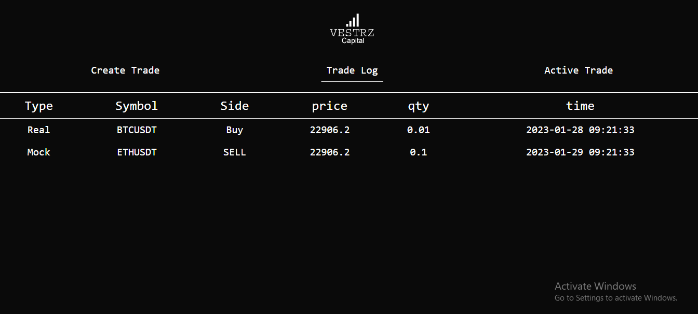

# Binance App

> Binance App that can do binance actions using Binance API.

## Table of Contents

- [General Info](#general-information)
- [Technologies Used](#technologies-used)
- [Features](#features)
- [Screenshots](#screenshots)
- [Setup](#setup)
- [Usage](#usage)
- [Project Status](#project-status)
- [Room for Improvement](#room-for-improvement)
- [Acknowledgements](#acknowledgements)
- [Contact](#contact)

## General Information

- This project is Binance Trading Platform.
- It figures out simple Buy & Sell action in Binance.
- Purpose of this project is to make customized binance actions and settings view for Binance.
- The reason I undertook this project is to make customized Binance Trading View.

## Technologies Used

- Tech 1 - MERN
- Tech 2 - Binance API
- Tech 3 - 2FA

## Features

- Customized Trading Settings
- Trading Logs
- Customized Trading Actions

## Screenshots

## Setup

This project requires node environment and uses npm packages.
Just clone the project and `npm install`.

You need to setup node environment. Install Node.js platform.

## Usage

Configure your trading settings and enjoy trading in Binance platform.

## Project Status

Project is: _no longer being worked on_. The reason is related to client.

## Room for Improvement

Room for improvement:

- React Router v6
- Redux Structure

To do:

- Complex Trading Actions
- Advancde Two Factor Authentication

## Acknowledgements

- This project was inspired by ByteRoad.
- This project was based on [this tutorial](https://binance-docs.github.io/apidocs/spot/en/).
- Many thanks to smartdev1010.

## Contact

Created by [Bohdan](https://softdev629.github.io) - feel free to contact me!
